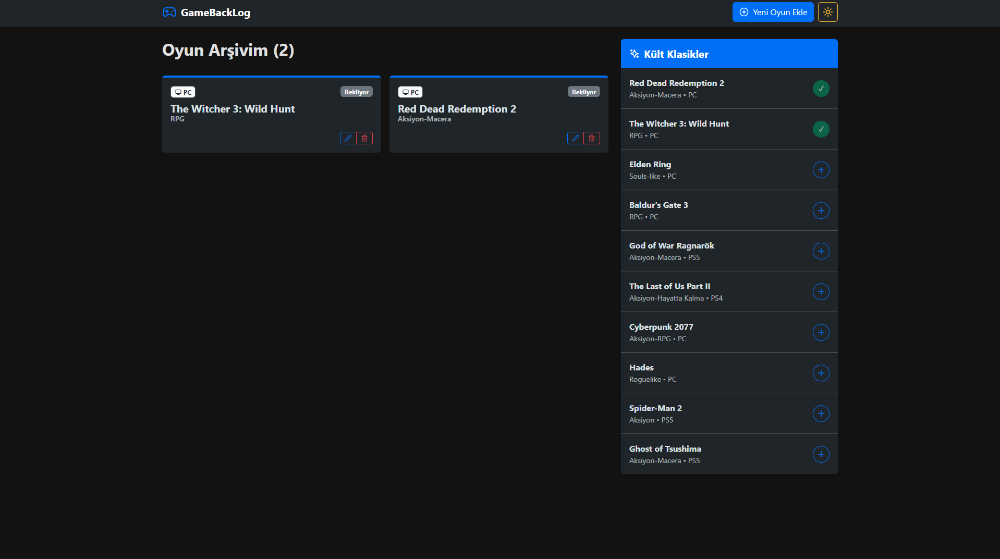
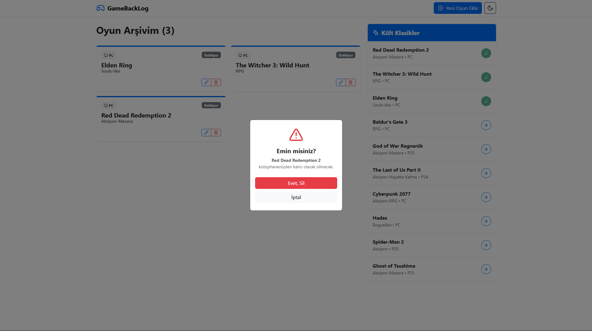

# 🎮 GameBackLog - Kişisel Oyun Kütüphanesi

Modern ve kullanıcı dostu bir arayüz ile oyun arşivinizi yönetmenizi sağlayan bir React uygulamasıdır. Bu proje, staj proje yönergesine tam uygun olarak geliştirilmiştir.



## ✨ Özellikler

- **Tam CRUD Desteği**: Oyun ekleme, listeleme, güncelleme ve silme işlemleri.
- **Kült Klasikler**: Popüler oyunları tek tıkla arşivinize ekleyebileceğiniz hızlı erişim menüsü.
- **Gece/Gündüz Modu**: Bootstrap 5'in yerleşik tema desteği ile entegre, göz yormayan karanlık mod.
- **Animasyonlar**: `framer-motion` ile pürüzsüz kart geçişleri ve etkileşimler.
- **Yerel Depolama (LocalStorage)**: Verileriniz tarayıcıda saklanır, sayfa yenilendiğinde kaybolmaz.
- **Responsive Tasarım**: Mobil ve masaüstü cihazlarla tam uyumlu Bootstrap arayüzü.

## 📸 Ekran Görüntüleri

### Ana Panel (Gündüz Modu)


### Oyun Güncelleme ve Detaylar (Karanlık Mod)


## 🚀 Kurulum

Projeyi yerel bilgisayarınızda çalıştırmak için aşağıdaki adımları takip edebilirsiniz:

1.  **Projeyi bilgisayarınıza indirin veya klonlayın.**
2.  **Bağımlılıkları yükleyin:**
    ```bash
    npm install
    ```
3.  **Uygulamayı başlatın:**
    ```bash
    npm run dev
    ```
4.  **Uygulamaya erişin:**
    Tarayıcınızda `http://localhost:5173` adresini açın.

## 🛠 Kullanılan Teknolojiler

- **Framework**: [React](https://reactjs.org/) + [Vite](https://vitejs.dev/)
- **Stil**: [Bootstrap 5](https://getbootstrap.com/) + [React Bootstrap](https://react-bootstrap.github.io/)
- **Animasyonlar**: [Framer Motion](https://www.framer.com/motion/)
- **İkonlar**: [Lucide React](https://lucide.dev/)
- **State Yönetimi**: React Hooks (useState, useEffect)

## 📁 Proje Yapısı

Yönergedeki klasör yapısına sadık kalınmıştır:
- `src/components`: UI bileşenleri (Header, GameCard, Form vb.)
- `src/pages`: Sayfa seviyesindeki bileşenler.
- `src/interfaces`: Veri yapıları ve prop tanımları.

---
*Bu proje bir staj projesi kapsamında hazırlanmıştır.*
*Serra Tozlu*